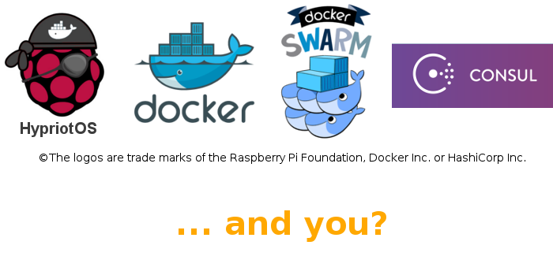

# Hypriot Cluster Lab

The Hypriot Cluster Lab is a piece of software that can be installed on nodes within a network, which then will be automatically combined to a cluster of nodes.
This is an out-of-the-box solution that creates a fully auto-configured cluster within only a few minutes.

This cluster opens up numerous possibilities:
  - Run distributed applications in a *real* cluster
  - Play with Docker, Swarm and its tool set
  - Learn about networking, load balancing, high availability
  - ... and much more!

Technologies used include the Docker stack (Docker-Compose, Swarm), Consul, and standardized features of computer networks, such as VLANs.



**You are very welcome to extend this lab, whether with a technical contribution or some conceptional ideas!**  <br /> This software basically consists of a large and a small bash script, that's it. We tried to make it as easy as possible to understand what's happening. 

Get in touch with us and the community in our [Gitter chat](https://gitter.im/hypriot/talk), on our [Blog](http://blog.hypriot.com/armed_docker_swarm_cluster_for_testing), on [Twitter](https://twitter.com/HypriotTweets), send a PR, ... Just choose the way you prefer. We look forward to any suggestion!

If you wanna know more about why we created this project, please see our [corresponding blog post](http://blog.hypriot.com/post/introducing-hypriot-cluster-lab-docker-clustering-as-easy-as-it-gets/)!

## How to run

### Hardware Requirements

- At least two Raspberry Pi's 1 or 2 (all models with a network interface will work, i.e. **B** or **B+**), and for each
  - Power supply
  - MicroSD card
  - Network cable
- A network switch that is somehow connected to the Internet. This network switch must not filter IEEE 802.1Q VLAN flags out of network packets. NB! This features is often also provided by low costs switches

You can test this by building a cluster of two nodes. On the node you started second, execute `ping 192.168.200.1`. If this ping fails, but you can login into the first node via SSH, your switch probably filters VLAN flags and is therefore not suitable for this cluster lab.


### Option 1: Flash SD card image and boot each nodes from it
  - [Download SD card image here](http://blog.hypriot.com/downloads/#hypriot-cluster-lab:2a4af035d9e12b64c084b5e7cfb2c420)
  - Flash the image on one SD card for each Raspberry Pi ([this script makes flashing easy for you](https://github.com/hypriot/flash))
  - Plug the SD cards in each node and power **only one** node on. This node will be the Master of the cluster.
  - Get the IP address of this node and open your browser at **http://{IP of the node}:8500**. You should see the Consul web interface listing one node. Proceed with the next step only if you see the web interface. Grant the node about 2 minutes to create it.
  - Power on all other nodes. After about 2 minutes, you should see all of them being listed in the Consul web interface.

### Option 2: Install the Cluster Lab as Debian Package
  - Boot one node on the [latest HypriotOS](http://blog.hypriot.com/downloads/) (you need "Version 0.5 Will" or above. Other OSes have just not been tested yet. Please ping us if you wanna help testing this!)
  - Get the IP of this node and connect to it via SSH (See our [getting-started guide](http://blog.hypriot.com/getting-started-with-docker-on-your-arm-device/) with HypriotOS if you need help here!

   `ssh pi@<IP of the node>`

  - Install the cluster lab software by executing

   `sudo apt-get update && sudo apt-get install hypriot-cluster-lab && sudo systemctl start cluster-start`

  - On any device in the same LAN network, open a browser at **http://{IP of the node}:8500**. You should see the Consul web interface listing one node. Proceed with the next step only if you see the web interface. Grant the node about 2 minutes to  create it.
  - Install the cluster lab software on all other nodes with the command given above. About 2 minutes after each install, you should see the nodes being listed in the Consul web interface.


## Test it and play with it
  - We prepared some [use cases about loadbalancing or playing with distributed databases](https://github.com/hypriot/rpi-cluster-demo) that you can go through step by step. 
  - You can use **Docker Swarm** by only providing one additional parameter in your Docker commands. For instance, when starting a container, Docker Swarm will distribute it on the cluster nodes according to a specific strategy (see details about strategies [here](https://docs.docker.com/swarm/scheduler/strategy/). We use the default strategy, which is `spread`). <br />
  Start with listing all containers in the cluster by logging in via SSH to the cluster leader and execute

    `docker -H tcp://192.168.200.1:2378 info`
    
  on any node of the cluster.    

  - List all consul members:

    `docker run -ti --rm hypriot/rpi-consul members -rpc-addr=192.168.200.1:8400`

  Note: Consul listens on several different ports. Please see section *Ports used* in the [offical docs](https://www.consul.io/docs/agent/options.html) for detailed info why is that.
  - Check if `eth0` is member of the virtual network
    
    `ip -d addr show`

    Interface `eth0` should have the tag `200` listed.
  - Start the [Dockerui](https://github.com/crosbymichael/dockerui) to see all containers on a neat website:

    `docker run -d -p 9000:9000 --name dockerui hypriot/rpi-dockerui -e http://192.168.200.1:2378`
  
  - Start a container on a specific node with `--env="constraint:node==<hostname of RPi>"`
  
    `docker run -itd --env="constraint:node==<hostname of RPi>" hypriot/rpi-nano-httpd`

## Use Cases

### Use Case 1: Ping a web server within a virtual network using `libnetwork` introduced in Docker 1.9.0

  - Create new virtual Network

    `docker network create -d overlay my-net`
  
  - Create new web server on specific node. Here, the hostname has been set to **node2**. Execute `hostname` to see your hostname. Of course, you an also use IP addresses accordingly.

    `docker run -itd --name=web --net=my-net --env="constraint:node==node2" hypriot/rpi-nano-httpd`
    
  - Use a container on a different node to ping the web server within the virtual network. Here, the node's hostname is **node3**:

    `docker run -it --rm --net=my-net --env="contraint:node=node3" hypriot/armhf-busybox wget -O- http://web`

Inspired by [@chanezon](https://github.com/chanezon/docker-tips/blob/master/orchestration-networking/swarm-local.sh), ported by @StefanScherer.

### Use Case 2: Suggest a use case!


## Troubleshooting
  - Check if the service providing the cluster functionality is running. Execute

    `sudo systemctl status cluster-start`

  - Start the cluster service manually by

    `sudo systemctl start cluster-start`

  - In case the node, which started second also cosiders itself to be the master, your network switch might not support VLAN, i.e. it filters out VLAN tags of network packages. To test if your switch supports VLAN, follow these steps:
    - Take two Linux machines of any kind, regardless of its settings. You can also use the Cluster Lab SD card image as operating system. If you run your Desktop machine on Linux, you can consider this one as first machine. 
    - Connect these machines to your switch.
    - Log in to the first machine. Run
    ```
    sudo ip link add link eth0 name eth0.555 type vlan id 555
    sudo ip link set dev eth0.555 up
    sudo ip addr add 10.10.10.1/24 dev eth0.555 
    ```
    - Log in to the second machine. Run
    ```
    sudo ip link add link eth0 name eth0.555 type vlan id 555
    sudo ip link set dev eth0.555 up
    sudo ip addr add 10.10.10.2/24 dev eth0.555 
    ping 10.10.10.1
    ```
    The `ping` should spit out some feedback from `10.10.10.1`. Otherwise, your switch probably does not support VLAN. Since usually this feature is provided even by cheap switches, try to find just any other switch you may have around.
    
    - Reset the machines to the state before you started this test. Execute on both of them
    
    `ip link delete eth0.555`

  - In case you get an error `network sandbox join failed: error creating vxlan interface: operation not supported` or similar vxlan not supported errors, your linux kernel misses vxlan support. This problem can be fixed by compiling your own kernel with `CONFIG_VXLAN=m`. The provider of your linux distribution might provide more details on how to do this.
  - If you would like to change the VLAN ID, execute the following commands on all nodes on the cluster
    
    - Make sure that you are logged in as **root**. Otherwise, execute`sudo -s`.
    
    - `systemctl start cluster-stop`
    
    - Replace `XXX` in the following command with the VLAN ID you would like to use and execute it:
     
      `cd /usr/local/bin && sed -i 's/eth0.200/eth0.XXX/g' cluster-stop.sh && sed -i 's/eth0.200/eth0.XXX/g' cluster-start.sh && sed -i 's/id\ 200/id\ XXX/g' cluster-start.sh && sed -i 's/tag\ 200/tag\ XXX/g' cluster-start.sh && sed -i 's/vlan\ 200/vlan\ XXX/g' cluster-start.sh`
    
    - To test it, execute `grep -r 200 cluster-*`. If you only get 5 lines of code as output, the substitution was successful.
    
    - `systemctl start cluster-start`
    
    - To test it, execute `ip a`. You should see a network interface **eth0.XXX@eth0** showing your new VLAN ID.
  - A reboot often helps :-)
  - Ping us on Twitter or request help in our [community chat](https://gitter.im/hypriot/talk).

## Known Bugs
- Consul follower join the cluster leader with the docker0 bridge IP
- Restart after changing avahi-daemon config is missing

## Roadmap

### Ideas of Features
- Instead of installing additional packages in the cluster-start.sh, add these additional packages as *dependency* to deb package (e.g. dnsmasq)
- Install deb package in ClusterLab image instead of copying cluster-lab files.
- Add ahmetalpbalkan/wagl as service discovery
- Make consul follower listen and bind only to the VLAN IP [Bug 1]
- Make VLAN id and IP range changeable
- Add leadercheck to consul (watches consul info)
- Combine the two systemd services (cluster-start and cluster-stop) into one with ExecStart and ExecStop
- Test with other hardware, such as Raspberry Pi Zero
- Test with Raspbian and other OSes (e.g. armbian)

### Ideas of Use Cases:
- Run Dockerui-Image on first boot (like swarm)
- Kubernetes
- Crate.io
- Run Registrator, Consul-Template, HAProxy, and hypriot/busybox-httpd on first boot (like swarm)


## Some technical background about how it works
  - Most network communications in the cluster are primarily exchanged within a Virtual LAN (VLAN) with ID `200`, which is assigned on `eth0` on each device. <br />
   The network mask of the VLAN is `192.168.200.0/24`.
  - The node that runs the cluster lab software first is the *cluster leader*. The cluster leader's IP address is statically configured to `192.168.200.1`. The cluster leader bootstraps Consul as first instance within the cluster.
   The cluster leader starts a DHCP server using DNSMasq and dynamically assigns IP addresses to all other nodes in the cluster, which are called *slaves*.
   Thereby, IP addresses from DHCP are only provided within the VLAN, at a range from `192.168.200.101` to `192.168.200.200`
  - After the slaves successfully received their IP addresses, they join the Consul cluster that has been created by the cluster leader. In addition, all slaves join
    Docker Swarm, which is managed via Consul.
  - The Swarm management interface is running on the master node on Swarm's default Port:`tcp://192.168.200.1:2378`

## Related projects
  - http://blog.arungupta.me/docker-swarm-cluster-using-consul/
  - https://github.com/luxas/kubernetes-on-arm
  - http://besn0847.blogspot.de/2015/11/building-internet-wide-container.html
  - http://matthewkwilliams.com/index.php/2015/04/03/swarming-raspberry-pi-docker-swarm-discovery-options/
  - http://blog.scottlowe.org/2015/03/06/running-own-docker-swarm-cluster/
  - https://github.com/dduportal/rpi-utils/blob/master/documentation/docker-swarm.md

## Maintainers and Core Developers
Git does not reflect all involved contributors when doing pair programming. The core developers of this software are

  - Andreas Eiermann @firecyberice
  - Mathias Renner @MathiasRenner
  - Govinda Fichtner @Govinda-Fichtner

from the Hypriot Team.
